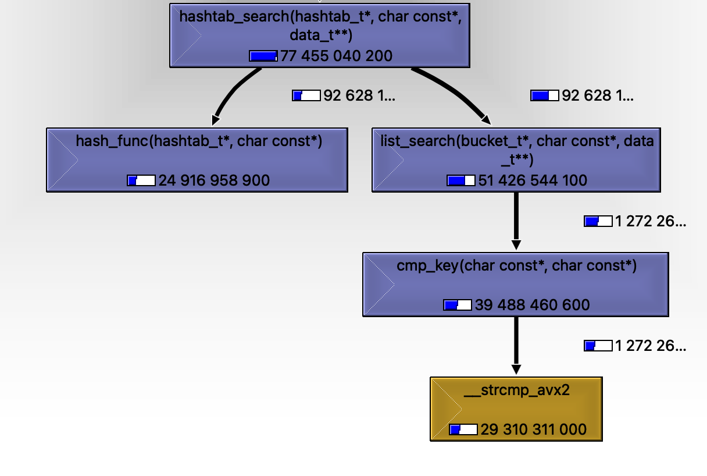
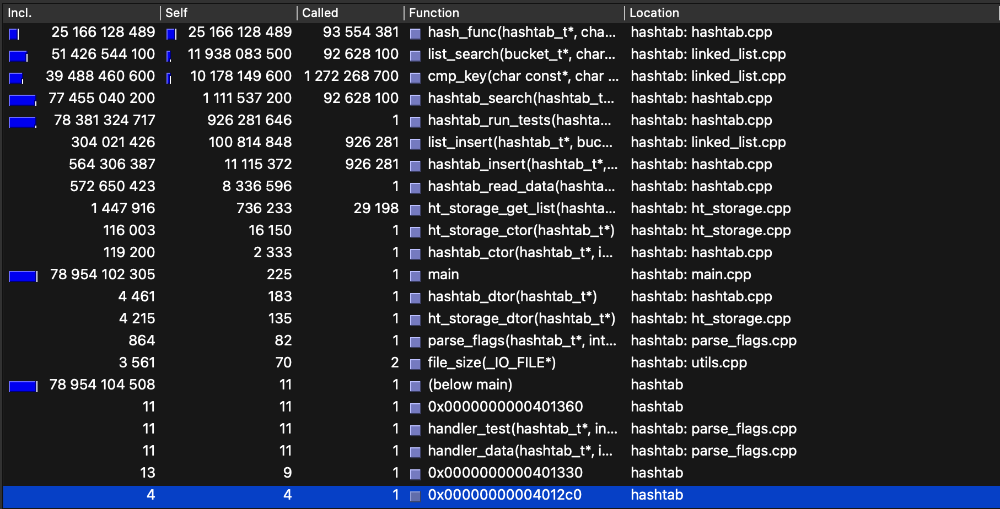
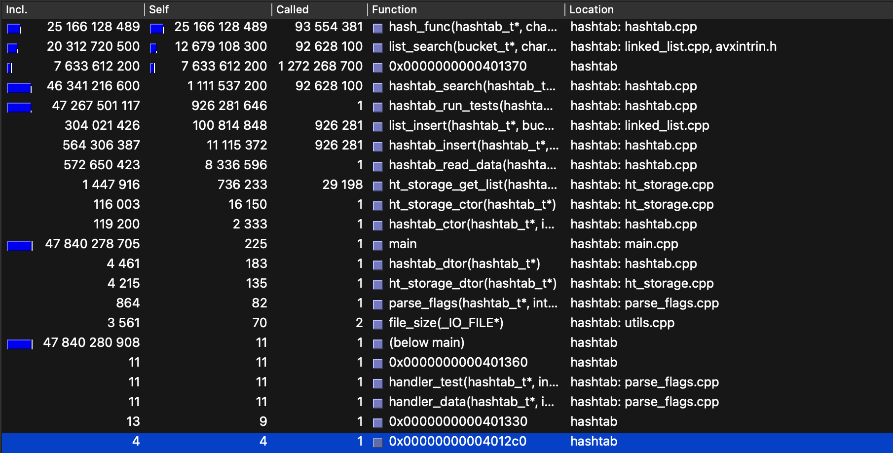
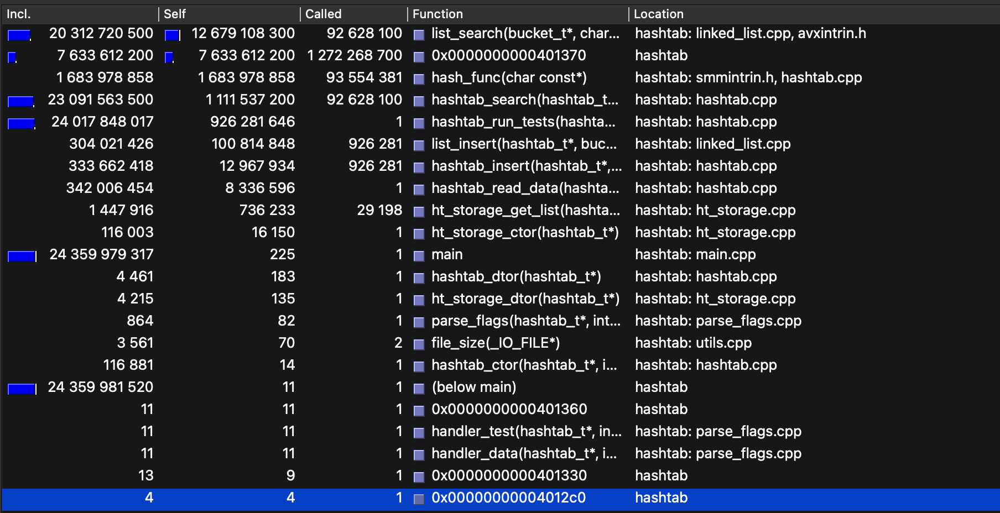
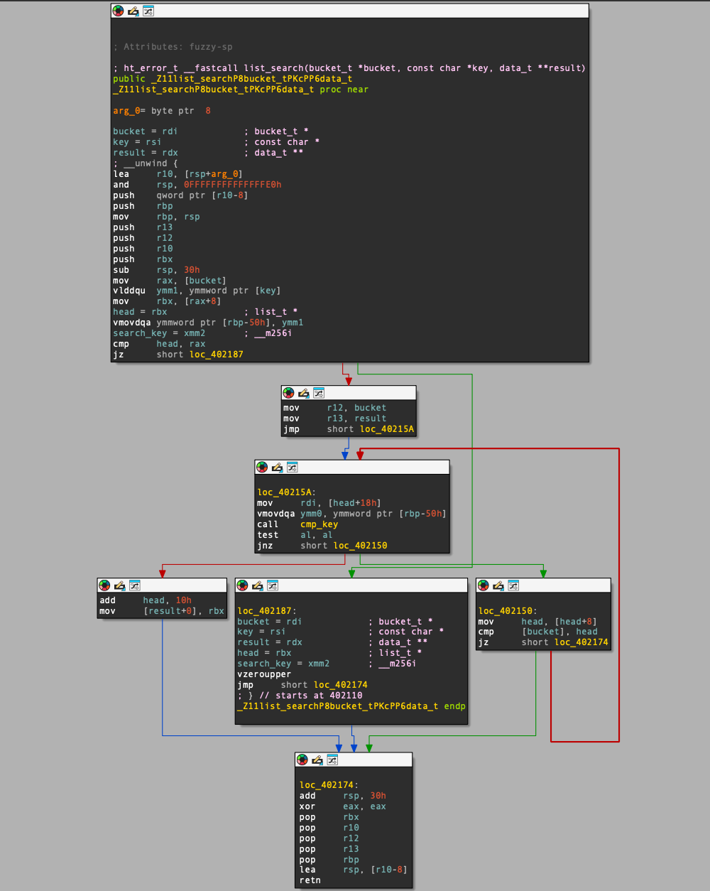
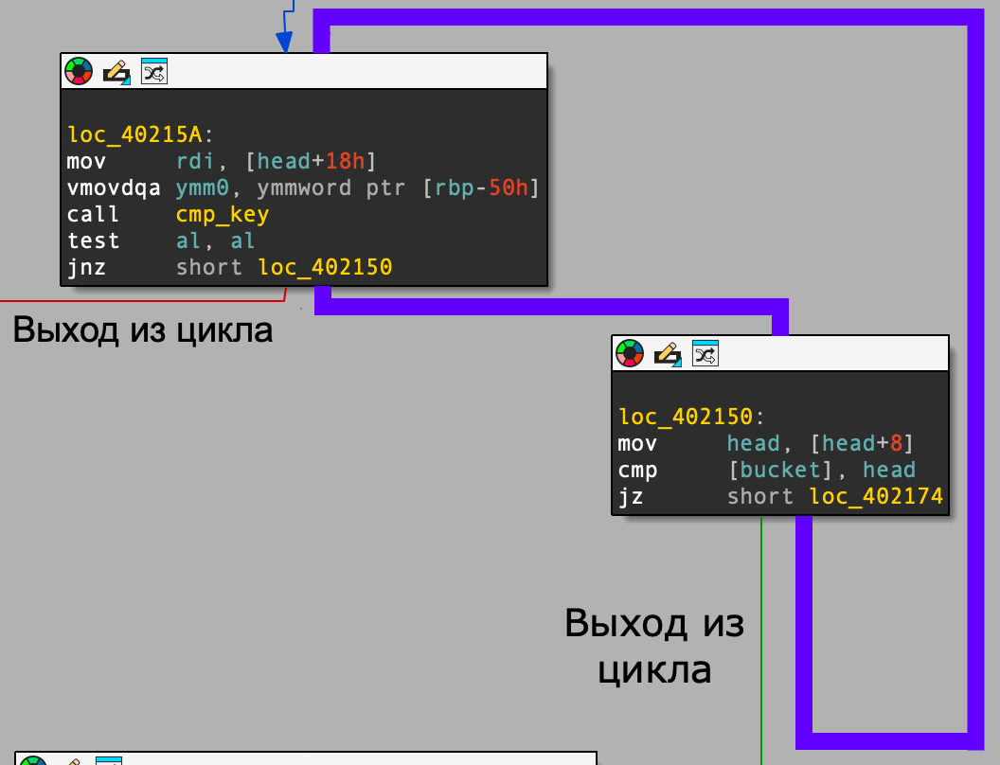
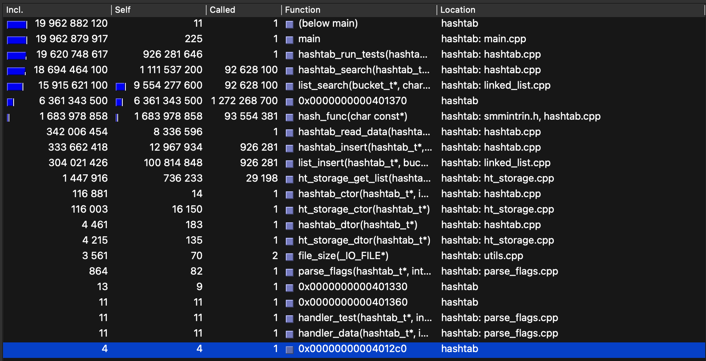
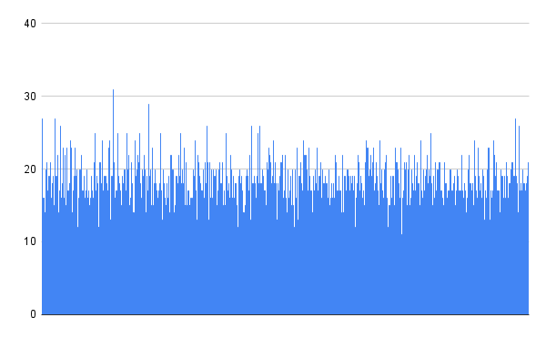

# Хэш-таблица

## 1. Описание

Основная задача проекта заключается в оптимизации поиска по хэш-таблице. Эта структура данных в нашем случае используется для вычисления количества повторений слов в полном собрании сочинений Шекспира. Небольшая доработка позволит использовать этот проект как библиотеку для хранения произвольных данных.
Для оптимизации нужно использовать возможности ассемблера. Это сделает код менее читаемым, однако поможет использовать больше мощности процессора доступной нам.
Ассемблерные оптимизации должны быть представлены в трёх видах:
- Ассемблерная вставка в языке C
- Функция полностью написанная на ассемблере
- Интринсики
Для возможности аппаратной оптимизации будем выбирать количество бакетов в хэш-таблице такое, чтобы число $LoadFactor$, то есть среднее количество элементов в каждом бакете, было равно 15.

## 2. Используемые технологии

- Для оценки производительности и частоты вызывания каждой функции используется профилировщик **Valgrind** с плагином **Callgrind**
- Для поиска возможностей оптимизации используется дизассемблер **IDA**
- Программа **Doxygen** для генерации документации кода

## 3. Особенности

### 3.1 Выбор уровня оптимизации

Для включения оптимизаций используются константы __*_OPTIMIZE_HASH*__, __*_OPTIMIZE_STRCMP*__ и __*_OPTIMIZE_SEARCH*__ в файле ```include/config.h```. Значение этих констант станет понятно в описании оптимизаций проведённых с таблицей. Стоит отметить что включение оптимизаций с помощью __*_OPTIMIZE_HASH*__ и __*_OPTIMIZE_STRCMP*__ безопасно при соответствии правилам хранения базы данных описанных в соседнем разделе. Информацию об опасностях включения оптимизации с помощью флага __*_OPTIMIZE_SEARCH*__ можно найти в [этом разделе](#searchopt).

### 3.2 Формат базы данных

Данный раздел дополнялся по ходу оптимизации, поэтому правила описанные далее станут понятными при прочтении.

Правила для хранения базы данных:
- Каждое слово хранится в блоке из 32 байт. Длина слова не может превышать 32 символа.
- Длина файла с базой данных должна быть кратна 32, файл не должен содержать ничего лишнего кроме слов в блоках.

### 3.3 Запуск теста

Для запуска теста необходимо прописать в консоль, находясь в папке с проектом:
```bash
bin/hashtab --test 'path_to_your_data' 'path_to_your_test'
```
Программа сначала загрузит данные из файла 'path_to_your_data' в таблицу, а затем последовательно выполнит поиск каждого слова из 'path_to_your_test'. Формат файла с тестом должен совпадать с форматом базы данных.

Для создания базы данных из файла с произвольными словами можно воспользоваться следующей командой:
```bash
bin/hashtab --parse 'path_to_your_data' 'path_to_output'
```
Программа разобьёт текст из файла 'path_to_your_data' на слова (любой символ не являющийся буквой считается разделителем). Результат будет совпадать с форматом базы данных. База данных будет записана в файл 'path_to_output'.

Для проверки load factor можно воспользоваться флагом:
```bash
bin/hashtab --load 'path_to_your_data' 'path_to_output'
```
Программа запишет все данные в хэш-таблицу, посчитает средний load factor и дисперсию этой величины. Также для каждого бакета количество элементов в нём будет записано в файл 'path_to_output'.

### 3.4 Документация
Документация доступна по [ссылке](https://artemneskorodov.github.io/hashtab/html/index.html).

## 4. Параметры системы

| Процессор | AMD EPYC (1st Gen) 2.5 GHz |
| --------- | -------------------------- |
| ОС        | Debian 12                  |
| ОЗУ       | 2 Гб                       |
| Компилятор| g++ 12.2.0                 |

## 5. Метод поиска мест для оптимизации

В этой работе мы занимаемся ускорением поиска по хэш-таблице.

Наибольший интерес представляют функции, занимающие большую часть времени выполнения программы, так как их оптимизация может дать резкий прирост производительности. Для поиска таких функций воспользуемся профилировщиком **Valgrind** с плагином **Callgrind**. Это позволит нам получить всю необходимую информацию: общее количество тактов выполнения интересующих нас функций, а также самую долгую функцию. Программа **Qcachegrind** позволит нам удобно произвести анализ профиля в графическом окне.

Также некоторые функции в программе вызываются из разных мест, например, подсчёт хэша. Для того чтобы было удобно оценивать наиболее долго выполняющуюся функцию в поиске необходимо сделать так, чтобы суммарное время выполнения поиска было много больше времени выполнения инициализации хэш-таблицы, тогда в таблице программы **Qcachegrind** при сортировке по колонке `Self` (в этом столбце содержится количество тактов процессора, затраченное на выполнение каждой функции без учёта дочерних вызовов) сверху будут отображаться функции, связанные с поиском. Для этого каждое слово теста будем запускать по несколько раз.

Для оценки прироста производительности будем после каждой выполненной оптимизации сохранять значение количества тактов процессора потраченное на выполнение функции `hashtab_search(...)`, будем называть эти значения $T_i$ с названиями оптимизированных элементов в индексах. Также будем вычислять коэффициент оптимизации программы $k$: отношение нового значения $T_i$ к предыдущему $T_{i-1}$. Последний упомянутый параметр служит лишь для оценки текущего прироста производительности и не используется нигде далее, соответственно его мы будем называть без индексов и значение будет относиться только к своему разделу, посвящённому конкретной оптимизации.

## 6. Ход оптимизации

### 6.1 Предположения
- - -

Скорее всего наибольшее время займут функции, выполняющиеся много раз: сравнение строк и подсчёт хэша. Предусмотрим возможности для их оптимизации сразу, а если они нам не понадобятся, то исправим некоторые участки.

#### 6.1.1 Возможность оптимизации для сравнения строк

Предположим, что все слова имеют длину менее 32 байт, тогда для их сравнения можно использовать SIMD инструкции. Добавим в правила хранения базы данных *пункт 1*: каждое слово в файле должно храниться в блоке по 32 байта, а все байты, кроме самого слова, должны быть заполнены нулями. Таким образом мы обеспечиваем удобную возможность для оптимизации. Если понадобится использовать хэш-таблицу для хранения данных произвольной длины, то будет несложно добавить обработку общего случая, которая несильно повлияет на производительность: в базу данных можно записывать длину строки или набор флагов.

#### 6.1.2 Возможность оптимизации для подсчёта хэша

Процессоры X86-64 с поддержкой SSE4.2 имеют инструкции вычисляющие хэш ***crc32***. Вероятно это поможет оптимизировать программу. Выберем для нашей таблицы этот алгоритм подсчёта хэша. Валидность данного выбора подтверждена в разделе [**проверка валидности хэш-функции**](#hashcheck).

### 6.2 Программа без оптимизаций
- - -

Запускаем программу через профилировщик Valgrind.

**Qcachegrind** предоставляет возможность просмотреть граф вызовов. Для понимания стоит приложить его:
<div align="center">
    
    <p><i><b>Рисунок 1</b> Граф вызовов функции hashtab_search(hashtab_t *, const char *, data_t **) </i></p>
</div>

Результат профилирования представленный в графическом окне **Qcachegrind**:
<div align="center">
    
    <p><i><b>Рисунок 2</b> Профиль программы без оптимизаций </i></p>
</div>

Для программы без оптимизации получаем:
```math
T_{default} \approx 77455 \times 10^6
```

Как видно, дольше всего работает функция подсчёта хэша, однако если учесть, что функция `cmp_key(...)` является обёрткой `strcmp(...)`, и считать время собственной работы `cmp_key(...)` по колонке `Incl`, то дольше всего выполняется функция сравнения строк. В данном случае для описания лучше было бы использовать обычный вызов функции `strcmp(...)`, однако это не позволило бы правильно оценить время работы. Во время теста каждый результат поиска проходит проверку ещё одним вызовом `strcmp(...)`, который сравнивает исходный ключ и ключ найденного элемента. Таким образом смотреть на собственное время выполнения `strcmp(...)` было бы не объективно.

### 6.3 Оптимизация сравнения строк
- - -

Как уже говорилось для оптимизации сравнения строк будем использовать возможность сравнивать YMM регистры, хранящие в себе сразу 32 байта. Напишем эту функцию на ассемблере.

#### 6.3.1 До оптимизирования

```C
bool cmp_key(const char *key1, const char *key2) {
    return (strcmp(key1, key2) == 0);
}
```

#### 6.3.2 После оптимизирования

```ASM
cmp_key:
    vmovdqu ymm1, [rdi]
    vpcmpeqd ymm1, ymm0, ymm1
    vmovmskps rax, ymm1
    inc al
    setz al
    ret
```

Оптимизированная функция принимает 2 параметра:
- Первый с типом `__m256i`, с сохранённой строкой для поиска в списке, это позволит загрузить значение в регистр только один раз с помощью интринсика в функции `list_search(...)`. Этот параметр будет находиться в регистре `YMM0`.
- Второй параметр это указатель на текущую строку, он по соглашению о вызовах будет находиться в регистре `RDI`.

Функция загружает вторую строку в регистр `YMM1` из памяти, затем сравнивает регистры `YMM0` и `YMM1` и кладёт маску в регистр `AL`. Если строки равны, то в регистре `AL` после этих действий будет лежать число `0xFF`, то есть все биты будут установлены в 1. При увеличении регистра на 1 флаг `ZF` будет установлен в том и только в том случае если строки были равны.

#### 6.3.3 Результат оптимизации
Профилируем программу с данной оптимизацией
<div align="center">
    
    <p><i><b>Рисунок 3</b> Профиль программы с оптимизацией сравнения строк </i></p>
</div>

Искомые величины $T_{cmp}$ и $k$:
```math
T_{cmp} \approx 46341 \times 10^6
```
```math
k = \frac{T_{default}}{T_{cmp}} \approx 1.67
```

Также, как и в прошлый раз, узнаём, какую функцию будет выгодно оптимизировать в дальнейшем. Дольше всего выполняется функция подсчёта хэша, рассмотрим возможности для её оптимизации.

### 6.4 Оптимизация подсчёта хэш функции
- - -

Для оптимизации функции подсчёта хэша было выбрано использование интринсика, так как в данной функции достаточно использовать только одну инструкцию.

#### 6.4.1 До оптимизирования

```C
size_t hash_func(hashtab_t *ctx, const char *key) {
    /*--------------------------------------------------------------------*/
    uint32_t crc = 0xFFFFFFFF;
    /*--------------------------------------------------------------------*/
    for(size_t i = 0; i < KeyWordSize; i++) {
        crc = ctx->crc_table[(crc ^ (uint32_t)*key) & 0xFF] ^ (crc >> 8);
        key++;
    }
    /*--------------------------------------------------------------------*/
    return (crc ^ 0xFFFFFFFF) % BucketsNum;
}
```

#### 6.4.2 После оптимизирования

```C
size_t hash_func(const char *key) {
    /*--------------------------------------------------------------------*/
    const uint64_t *key_uint = (const uint64_t *)key;
    uint64_t crc = 0xFFFFFFFF;
    /*--------------------------------------------------------------------*/
    for(size_t i = 0; i < KeyWordSize / sizeof(uint64_t); i++) {
        crc = _mm_crc32_u64(crc, key_uint[i]);
    }
    /*--------------------------------------------------------------------*/
    return (crc ^ 0xFFFFFFFF) % BucketsNum;
}
```

#### 6.4.3 Результат оптимизации

Результат работы профилировщика представлен на рисунке:
<div align="center">
    
    <p><i><b>Рисунок 4</b> Профиль программы с оптимизациями сравнения строк и подсчёта хэша </i></p>
</div>

Получаем значения искомых величин $T_{cmp,hash}$ и $k$:
```math
T_{cmp,hash} \approx 23092 \times 10^6
```
```math
k = \frac{T_{cmp}}{T_{cmp,hash}} \approx 2.01
```

Из профиля программы также узнаём какая функция исполняется дольше всего теперь. Это функция поиска по связному списку.

<a id="searchopt"></a>

### 6.5 Оптимизация поиска элемента в списке
- - -

В коде на C тяжело заметить возможности для оптимизации поиска по связному списку. Однако внутренний цикл выполняется очень много раз (при нашем среднем load factor равном 15).

Рассмотрим эту функцию с помощью представления кода как графа в дизассемблере **IDA**
<div align="center">
    
    <p><i><b>Рисунок 5</b> Дизассемблированная функция поиска по списку </i></p>
</div>

На следующем рисунке выделена основная часть внутреннего цикла. Поток по циклу выделен <span style="color:#6200FF">фиолетовым</span> цветом. На рисунке также отмечены пути выхода из цикла: невыполнения условия в `while` и `break;` при нахождении нужного элемента.
<div align="center">
    
    <p><i><b>Рисунок 6</b> Дизассемблер основной части внутреннего цикла функции поиска по списку </i></p>
</div>

Первая оптимизация, которую можно применить, бросается в глаза сразу: функция `cmp_key(...)` в конце своей работы вычисляет флаг `ZF`, а затем его значение записывается в регистр `AL` как значение возврата. Затем функция `list_search(...)` использует команду `test al, al`, которая устанавливает флаг `ZF` и выполняет условный переход основываясь на его значении. Можно заметить, что запись в регистр и проверка значения этого регистра являются лишними действиями, ведь можно использовать уже установленный флаг `ZF` для условного перехода. Нам понадобится сделать ассемблерную вставку с передачей параметров, вызовом функции `cmp_key(...)`, а также условным переходом.
Также стоит отметить, что во все предыдущие использования функции `cmp_key(...)` можно добавить отрицание значения возврата, так как в регистре `AL` после её работы будет значение 0 (т.е. `false`) только в том случае, когда строки равны. Это позволяет не писать новую функцию для возможности отключения данной оптимизации.

Другая оптимизация тоже становится заметной только при дизассемблировании: компилятор не знает поведения функции `cmp_key(...)` и боится, что она может поменять значения переданных ей параметров. Соответственно регистр `YMM0`, в котором сохранено значение ключа, поиск которого мы производим, сохраняется в память. С помощью ассемблерной вставки можно заставить компилятор и не знать, что мы использовали этот регистр. Этот подход позволит значительно ускорить функцию, однако он весьма небезопасен. Использование таких ассемблерных вставок может привести к неопределённому поведению при неправильном использовании. Функция должна быть продиззасемблирована при каждой компиляции, а её правильность должна быть тщательно проверена программистом. Описание такого поведения должно быть важнейшим в документации. В реальном проекте не стоит допускать столь небезопасных оптимизаций, однако в учебном можно себе это позволить.

#### 6.5.1 До оптимизирования
```C
ht_error_t list_search(bucket_t     *bucket,
                       const char   *key,
                       data_t      **result) {
    list_t *head = bucket->head->next;
    /*--------------------------------------------------------------------*/
    /* Loading key that we need to find in YMM register if string compare */
    /* optimization is enabled.                                           */
    #if defined(_OPTIMIZE_STRCMP)
        __m256i search_key = _mm256_lddqu_si256((const __m256i *)key);
    #endif
    /*--------------------------------------------------------------------*/

    while(head != bucket->head) {

        bool cmp_result = false;
        #if defined(_OPTIMIZE_STRCMP)
            /*------------------------------------------------------------*/
            /* Calling assembler written cmp_key function if its          */
            /* optimization is enabled.                                   */
            cmp_result = !cmp_key(search_key, head->data.key);
            /*------------------------------------------------------------*/
        #else
            /*------------------------------------------------------------*/
            /* Calling default cmp_key function overwise.                 */
            cmp_result = cmp_key(key, head->data.key);
            /*------------------------------------------------------------*/
        #endif
        if(cmp_result) {
            *result = &head->data;
            break;
        }
        head = head->next;
    }
    /*--------------------------------------------------------------------*/
    return HASHTAB_SUCCESS;
}
```
#### 6.5.2 После оптимизирования
```C
ht_error_t list_search_optimized(bucket_t     *bucket,
                                 const char   *key,
                                 data_t      **result) {
    list_t *head = bucket->head->next;

    /*--------------------------------------------------------------------*/
    /* We don't change YMM registers in this function and we only change  */
    /* YMM1 and RAX in cmp_key, so we can avoid saving value of YMM0,     */
    /* which has written key in it to memory. This asm inline forces      */
    /* saving key string in YMM0 register.                                */
    asm("vmovdqu %[key], %%ymm0\n"
        :
        : [key] "m" (*key)
        : "%ymm0");
    /*--------------------------------------------------------------------*/

    while(head != bucket->head) {
        /*----------------------------------------------------------------*/
        /* This asm goto inline calls cmp_keys, without saving YMM0 to    */
        /* memory as we know that YMM0 is not changed by this functions.  */
        /* Last function instruction sets ZF flag to 1 if strings are     */
        /* equal, so we use JNZ instruction to skip writing the result.   */
        asm goto ("mov  %[key], %%rdi   \n"
                  "call cmp_key         \n"
                  "jnz %l[skip_cmp_true]\n"
                  :
                  : [key] "r"  (head->data.key)
                  : "%rdi", "%ymm1", "%rax", "cc"
                  : skip_cmp_true);
        /*----------------------------------------------------------------*/

        /*----------------------------------------------------------------*/
        /* Writing the result and going out from loop. This part is       */
        /* skipped by previous asm goto if strings are not equal.         */
        *result = &head->data;
        break;
        /*----------------------------------------------------------------*/

        /*----------------------------------------------------------------*/
        /* This is C label which is used to jump to skip writing the      */
        /* result. It is used by previous asm inline in JNZ command.      */
        skip_cmp_true:
        /*----------------------------------------------------------------*/

        head = head->next;
    }
    /*--------------------------------------------------------------------*/
    return HASHTAB_SUCCESS;
}
```

#### 6.5.3 Результаты оптимизации
Вывод профилировщика:
<div align="center">
    
    <p><i><b>Рисунок 7</b> Профиль программы с оптимизациями сравнения строк, подсчёта хэша и поиска </i></p>
</div>

Искомые значения $T_{cmp,hash,search}$ и $k$:
```math
T_{cmp,hash,search} \approx 18694 \times 10^6
```
```math
k = \frac{T_{cmp,hash}}{T_{cmp,hash,search}} \approx 1.24
```

Это значение ещё велико и возможно стоило бы продолжить дальнейшую оптимизацию, однако так как данная задача является учебной, дальнейшая оптимизация не будет выполнена.

## 7. Итог оптимизации

Посчитаем отношение $T_{default}$ к $T_{cmp,hash,search}$:
```math
k = \frac{T_{default}}{T_{cmp,hash,search}} \approx 4.14
```

Программу удалось ускорить в $k$ раз. Это достаточно большое значение, которое также можно увеличить, однако, как было видно, уже последняя оптимизация добавила много проблем которые будет необходимо учитывать при дальнейшей разработке программы.

Количество ассемблерных строк, используемое для оптимизации в финальной версии:
```math
n  = 12
```

В этом значение учтены инструкции на языке ассемблера, интринсики, а также метки: одна метка функции и одна метка в коде на C которая используется для условного ветвления.

Значение коэффициента равного отношению коэффициента ускорения к количеству ассемблерных строк составило:
```math
\lambda = \frac{k}{n} \approx 0.35
```

Этот коэффициент не используется в реальности, однако он достаточно полезен. Программист должен соблюдать баланс между оптимизацией и читаемостью кода. Программа должна быть написан так, чтобы её было удобно отлаживать и изменять, однако оптимизация тоже важна. Коэффициент оптимизации $k$ в числителе $\lambda$ означает, что коэффициент тем больше, чем сильнее удалось ускорить работу программы в этом задании. Количество ассемблерных строк $n$ в знаменателе $\lambda$ означает что этот коэффициент тем меньше, чем больше ассемблерных строк использовано для оптимизации.

<a id="hashcheck"></a>

## 8. Проверка валидности выбора хэш функции

Гистограмма распределения данных для этого теста с хэшем __*crc32*__ по бакетам:

<div align="center">
    
    <p><i><b>Рисунок 8</b> Гистограмма распределения элементов по бакетам </i></p>
</div>

Для $LoadFactor$ получаем значение:

```math
LoadFactor = (15 ± 4)
```

Разброс величины достаточно велик, однако мы используем эту функцию для доступа к хэш-таблице, соответственно её скорость нам будет очень важна, а такой алгоритм хэша позволяет сильно оптимизировать программу.
